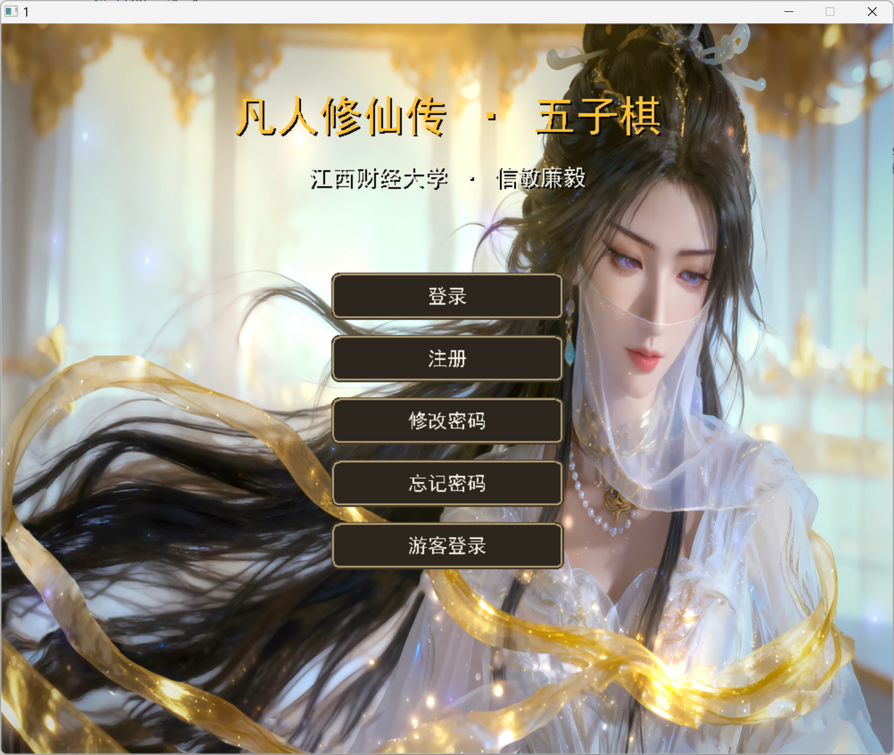
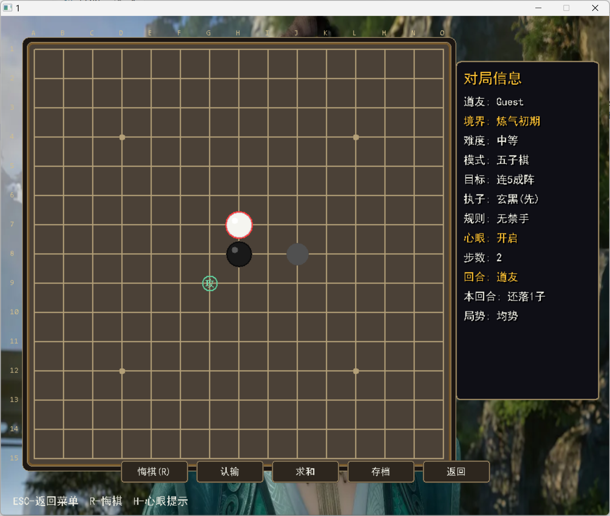
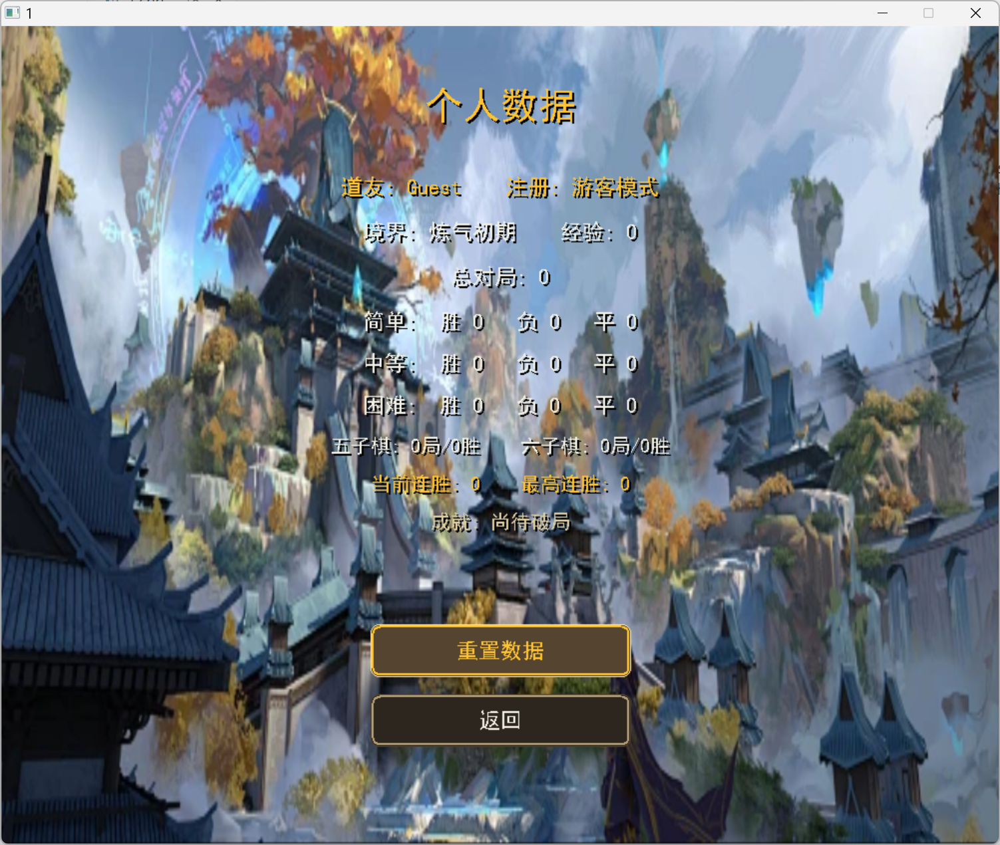

# 凡人修仙传 · 五子棋

EasyX 图形库实现的古风五子棋/六子棋小游戏，包含账号系统、人机对战、排行榜、残局挑战、存档和密码重置功能。

## 程序运行实例图片

以下图片展示程序运行中的登录入口、对局界面和个人数据页面。







## 运行环境

- Windows
- MinGW g++
- EasyX 图形库

## 编译

```powershell
g++ 1.cpp -o 1.exe -leasyx -lgdi32 -limm32 -lmsimg32 -lole32 -loleaut32 -finput-charset=UTF-8 -fexec-charset=UTF-8
```

编译后运行：

```powershell
.\1.exe
```

## 运行数据

以下数据文件不用提前放进项目：

- `admin_key.txt`：程序启动时会自动创建空文件；如果要使用“忘记密码”功能，需要手动在文件中写入管理员密匙。
- `users.dat`：注册账号后自动生成。
- `stats.dat`：产生对局结果后自动生成。
- `save_*.dat`：点击存档后自动生成；旧版 `save.dat` 只用于兼容读取，新版本不会主动生成。
