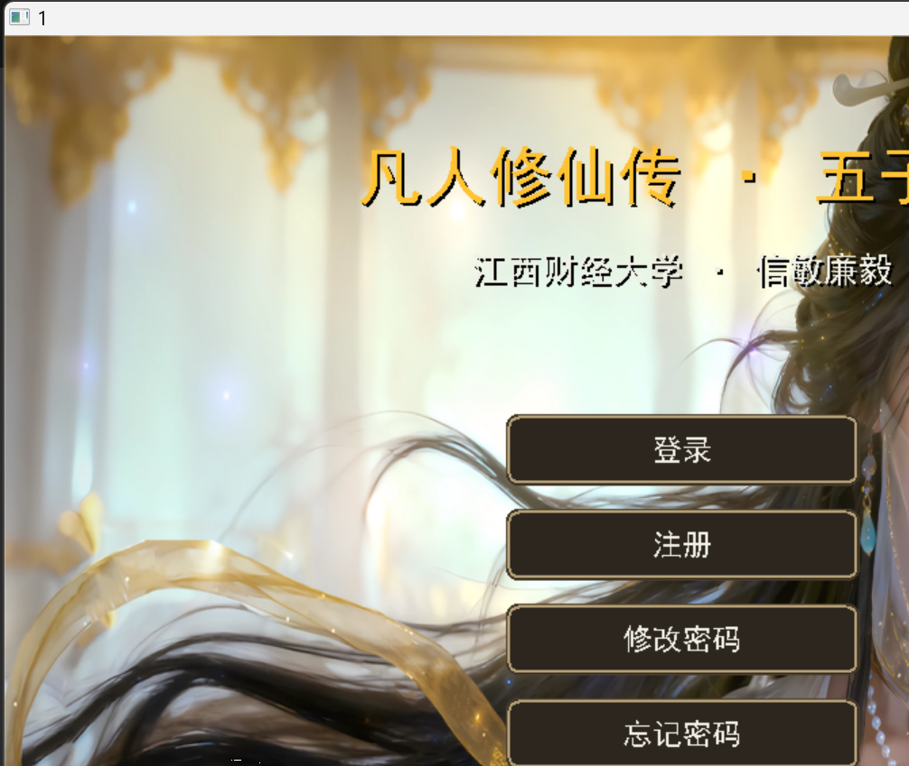
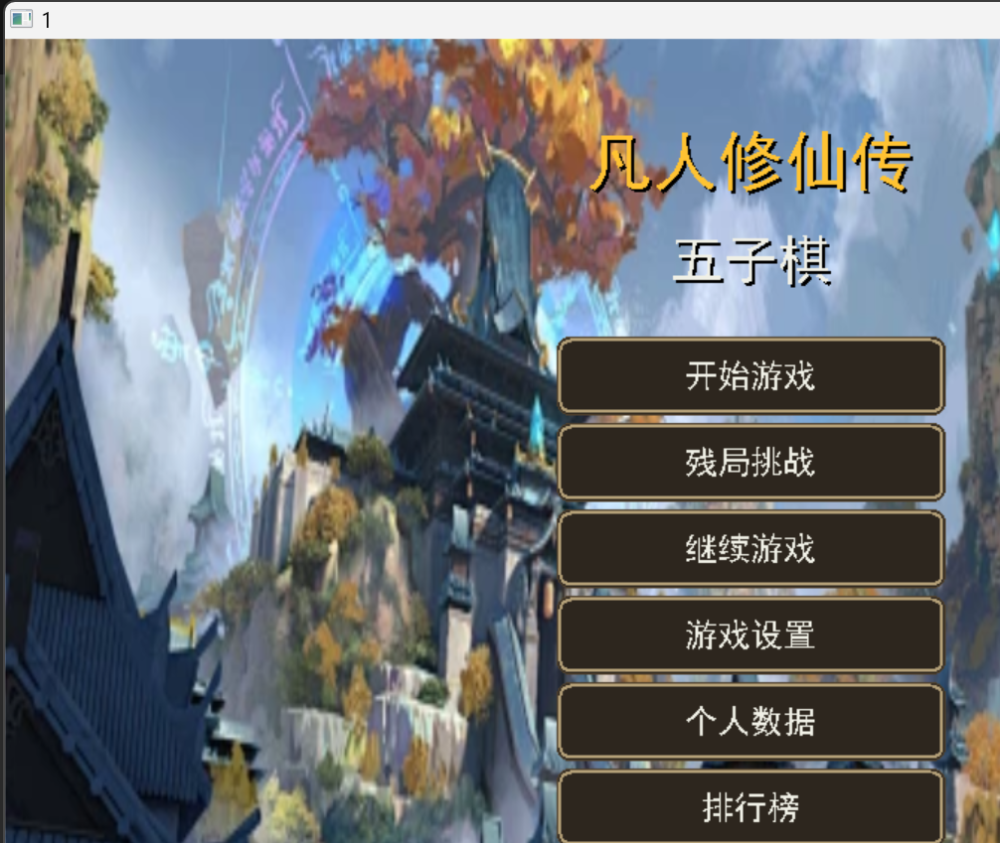
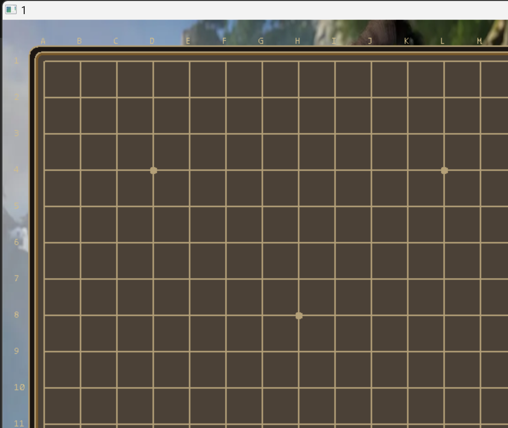

# 凡人修仙传 · 五子棋

EasyX 图形库实现的古风五子棋/六子棋小游戏，包含账号系统、人机对战、排行榜、残局挑战、存档和密码重置功能。

## 运行截图

登录界面：



游客主菜单：



对局界面：



## 运行环境

- Windows
- MinGW g++
- EasyX 图形库

## 编译

```powershell
g++ 1.cpp -o 1.exe -leasyx -lgdi32 -limm32 -lmsimg32 -lole32 -loleaut32 -finput-charset=UTF-8 -fexec-charset=UTF-8
```

编译后运行：

```powershell
.\1.exe
```

## 管理员密匙

`admin_key.txt` 不上传到 GitHub，用于忘记密码时校验管理员密匙。

以后换电脑克隆项目后，需要自己新建 `admin_key.txt` 并写入管理员密匙。

## 本地数据

以下文件是本机运行数据，不上传到仓库：

- `users.dat`
- `stats.dat`
- `save.dat`
- `save_*.dat`
- `admin_key.txt`
- `2202502640-邹清宇-程序设计实践课程设计-五子棋游戏.docx`
- `工作周志.txt`
- `五子棋.pptx`
